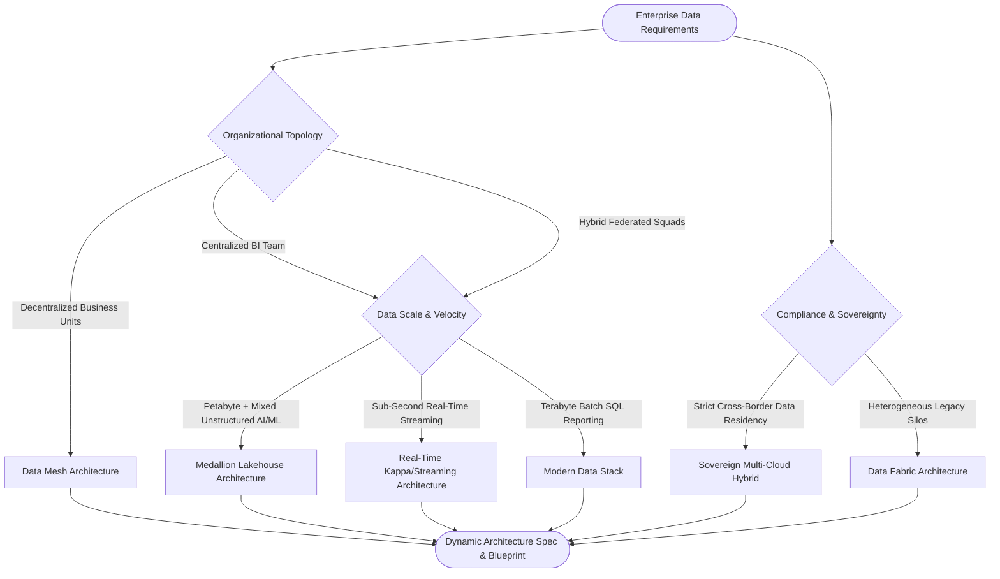

# ArchitectIQ | Enterprise Data Architecture Framework & Selection Engine

[](https://thesimonk.github.io/data-architect/)
[](https://github.com/thesimonk/data-architect)
[](https://github.com/thesimonk/data-architecture)

> **Enterprise Data Architecture Decision Engine & Interactive Selection Suite**  
> Designed to help enterprises evaluate, select, and design optimal data architecture frameworks (Medallion Lakehouse, Data Mesh, Data Fabric, Modern Data Stack, Real-Time Kappa/Streaming, and Sovereign Hybrid Multi-Cloud) based on organizational topology, latency, scale, compliance, and AI/ML requirements.

---

## Live Demo & Access

### Option 1: Live Interactive Web App (Hosted on GitHub Pages)
Launch the interactive application directly in your browser:  
[Launch ArchitectIQ Live Demo](https://thesimonk.github.io/data-architect/)

### Option 2: Clone & Run Locally
```bash
git clone https://github.com/thesimonk/data-architect.git
cd data-architecture
npm install
npm run dev
```
Open `http://localhost:5173` in your browser.

---

## Architecture Decision Flowchart

The decision engine routes organizational requirements through a 7-dimensional decision matrix:



---

## 16 Interactive Enterprise Modules

### 1. Decision Engine Wizard
- 7-Dimension assessment matrix with 4 1-click Enterprise Presets (*Global FinTech Streaming Fraud*, *Fortune 500 Data Mesh*, *Healthcare Sovereign*, *E-Commerce GenAI RAG*).

### 2. 7-Tier Blueprint Canvas
- End-to-end pipeline visualizer across Ingestion, Lakehouse Storage, Compute, Serving, Semantic/AI, Governance, and Consumption.

### 3. Interactive SVG Bezier Cable Graph Canvas
- Interactive node canvas connected by animated SVG Bezier cables with speed slider (1k to 10M msgs/sec).

### 4. Data Mesh Domain Topology Modeler
- Interactive domain boundary creator (Sales, Marketing, Supply Chain, Finance) with an interactive **SVG Inter-Domain Dependency Map**.

### 5. GenAI LLM RAG Pipeline Architect Sandbox
- Interactive RAG pipeline builder with controls for Chunk Size, Token Overlap, Vector Store selection (pgvector, Pinecone, Milvus), and Hybrid Search ratio.

### 6. PACELC Theorem Interactive Engine
- Evaluates PACELC guarantees (If Partitioned: Availability vs Consistency; Else: Latency vs Consistency) across distributed analytics stores.

### 7. Disaster Recovery & Multi-Region Simulator
- RPO (seconds) and RTO (hours) simulator recommending Active-Active Multi-Cloud vs Warm Standby replication strategies.

### 8. Zero-Trust Security & ABAC Policy Sandbox
- Interactive policy generator for column hashing (SHA-256), Format-Preserving Encryption (FPE), and Row-Level Security (RLS) with live DDL output.

### 9. Legacy Data Platform Migration Effort Estimator
- Calculates person-months, risk index, and 4-phase timeline when migrating legacy monoliths (Hadoop / Teradata / Oracle) to Lakehouse or Data Mesh.

### 10. Enterprise Paradigm Comparison Matrix
- Side-by-side comparative table evaluating 6 paradigms across 12 strategic dimensions.

### 11. Multi-Axis Architectural Tradeoff Radar
- SVG spider radar chart visualizing trade-offs across Cost, Simplicity, Scalability, Governance, Autonomy, and AI Readiness.

### 12. Workload Performance & Latency Benchmarks
- Empirical benchmark metrics comparing P95 query latency, ingestion lag, concurrency limits, and storage efficiency.

### 13. Enterprise FinOps Spend & Scale Simulator
- Real-time monthly USD cost breakdowns (Storage, Compute, Ingestion, Governance) with interactive sliders.

### 14. Data Quality Assertion & Isolation Sandbox
- Assertion builder testing `freshness_sla`, `null_rate_tolerance`, and `schema_drift` rules with quarantine logs.

### 15. Data Product Contract Modeler
- Visual schema contract editor with live YAML spec generator.

### 16. Senior Data Architect Reference Compendium
- Deep-dive technical articles covering Apache Iceberg internals, Data Contracts, FinOps strategies, PACELC theorem, Zero-Trust ABAC, and Vector RAG pipelines.

---

## Repository Structure

```
data-architecture/
├── .github/
│   └── workflows/
│       └── deploy.yml            # Automated GitHub Pages CI/CD Action
├── src/
│   ├── components/               # 16 interactive React enterprise modules
│   ├── data/                     # Paradigm specs, questions, cloud mappings, presets
│   ├── types/                    # TypeScript domain models
│   ├── utils/                    # Recommendation engine, sound synth, export utils
│   ├── App.tsx
│   ├── index.css
│   └── main.tsx
├── package.json
├── vite.config.ts                # Relative base configuration for GitHub Pages
├── tsconfig.json
├── index.html
└── README.md
```
